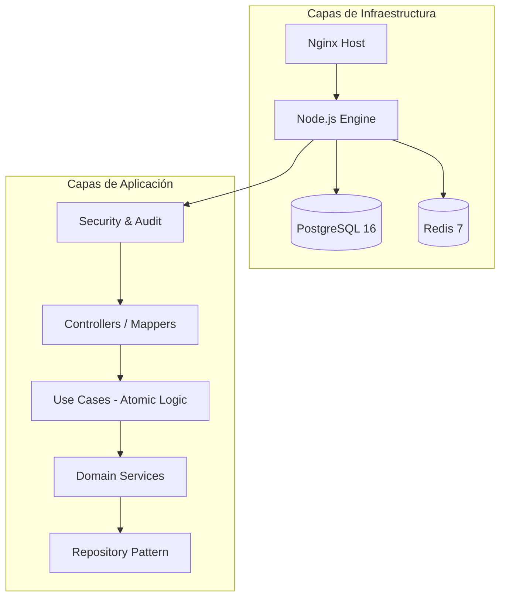

# 🎓 TeacherHub API: Senior Engineering Challenge

Backend de orquestación académica de grado empresarial. Esta implementación trasciende el CRUD básico para ofrecer una plataforma **escalable, auditable y de alto rendimiento**, cumpliendo con los criterios de evaluación **Senior** del reto técnico.

---

## 🌐 Live Environment (Production)
El servicio se encuentra desplegado y operativo en la infraestructura de AWS:
👉 **[https://api-teacherhub.iayala.dev/](https://api-teacherhub.iayala.dev/)**

---

## 🧪 Credentials for Testing
Para pruebas en el ambiente Live o local, puede utilizar el siguiente usuario con rol de **Owner**:

*   **Email:** `owner@teacherhub.mail`
*   **Password:** `C0ntrol@`

---

## 🏗️ Arquitectura de Referencia (Clean Architecture)

El sistema implementa una separación estricta de preocupaciones (SoC), garantizando que la lógica de negocio permanezca agnóstica a la infraestructura.



### Pilares Técnicos
- **Validación Predictiva:** Esquemas de **Zod** para validación de entrada (Fail-fast).
- **Capa de Persistencia:** Patrón **Repository** sobre TypeORM para desacoplamiento total de la base de datos.
- **Caché Distribuida:** Implementación de **Cache-aside** con Redis para optimizar lecturas masivas.
- **Auditoría E2E:** Registro de eventos con diferenciales de estado (`before`/`after`) en cada mutación.

---

## 🚀 Despliegue y Operación

### 📦 Desarrollo Local (Docker Optimized)
El entorno local emula la topología de producción, incluyendo balanceo y persistencia.
```bash
# Hard-reset y levantamiento del stack
docker compose down -v && docker compose up --build -d
```
- **Landing Page:** [http://localhost:3005](http://localhost:3005)
- **API Docs (Swagger):** [http://localhost:3005/docs](http://localhost:3005/docs)
- **Health Check:** [http://localhost:3005/api/health](http://localhost:3005/api/health)

### ☁️ Despliegue Canónico (AWS)
Flujo de entrega continua automatizado con **Ansible**.
```bash
make deploy
```
**Estrategia de Despliegue:**
1. **Build:** Compilación local de imagen inmutable.
2. **Injection:** Inyección de binarios vía túnel SSH seguro.
3. **Orchestration:** Configuración dinámica de Nginx y Docker-Compose modular en el host remoto.
4. **Validation:** Health-check post-despliegue con rollback preventivo.

---

## 🔑 Seguridad y Control de Acceso

Sistema basado en **API Keys** con permisos granulares (RBAC).

| Scope | Permiso |
| :--- | :--- |
| `teachers:read` | Consulta de catálogo docente |
| `teachers:write` | Creación y edición de profesores |
| `security:manage` | Administración de credenciales |
| `*` | Super Admin (Acceso total) |

---

## 🛡️ Senior Compliance Checklist
- [x] **Soft Delete:** Implementado para preservación de datos históricos.
- [x] **Rate Limiting:** Throttle dinámico en Redis con bloqueo incremental.
- [x] **Structured Logging:** Telemetría integrada para monitoreo de performance.
- [x] **Modular Infrastructure:** Contratos de Docker Compose separados por componentes (`app`, `postgres`, `redis`).

---
© 2026 IrvingAA Standard. Diseñado para la excelencia, construido para escalar. v1.0.1 🚀
